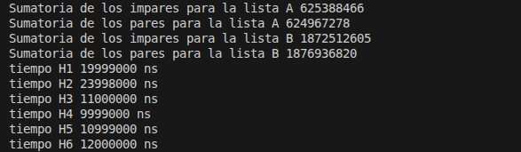
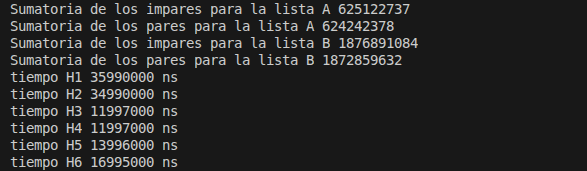
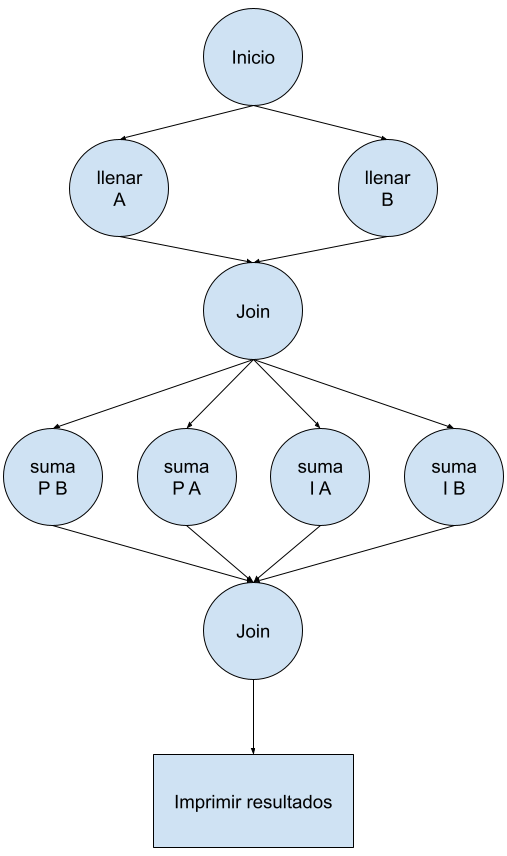
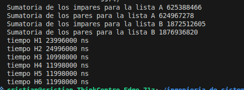
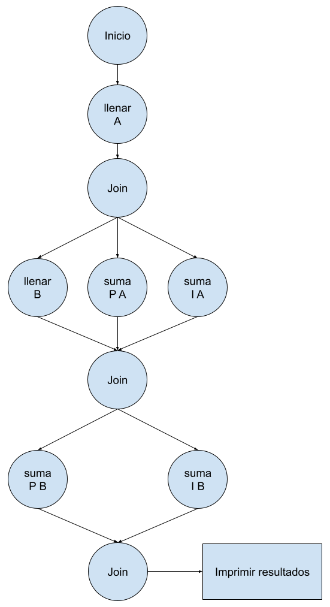
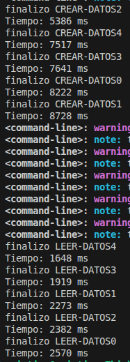
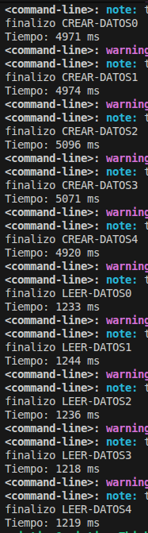

# ASYNC (Esto fue hecho en linux, se recomienda usar en mismo SO Ubuntu 24.04 lts)

# Requisitos de Entorno de Desarrollo

## Windows
### GnuCOBOL
- https://gnucobol.sourceforge.io/
- https://sourceforge.net/projects/gnucobol/files/
### SBCL (Common Lisp)
- https://www.sbcl.org/platform-table.html
### Java JDK (OpenJDK recomendado)
- https://adoptium.net/
- https://www.oracle.com/java/technologies/downloads/
### g++ (MinGW-w64)
- https://www.mingw-w64.org/
- https://winlibs.com/

---

## Linux (Debian/Ubuntu)
Primero ejecutar:
```bash
sudo apt update
```
### GnuCOBOL
```bash
sudo apt install gnucobol
```
### SBCL Common Lisp
```bash
sudo apt install sbcl
```
### Java JDK
```bash
sudo apt install openjdk-17-jdk
```
### g++ (GCC)
```bash
sudo apt install g++
```

---

## 1. Ejercicio a desarrollar:
Objetivo: Dividir una lista de números en dos partes y calcular la suma de cada parte en paralelo usando async y finish.
Generar una lista de 1000 números enteros aleatorios entre 0 y 9999.
Partir la lista en 4 sublistas, una de pares entre 0 y 4999 y la otra entre 5000 y 9999, las otras dos similaes pero de números impares.
Calcular la suma de cada sublista en tareas independientes.
Mostrar la suma total al final.

## Solución: 
Este desarrollo se realizo en LISP bajo el nombre ASYNC.lisp para ejecutarlo debe hacer uso de ***Common-lisp***, con el siguiente comando interpreta y ejecuta el programa (*recuerde estar en el directorio del mismo programa TALLER_1*):
#### Linux y Windows
```bash
sbcl --script ASYNC.lisp 

sbcl --script NO_ASYNC.lisp 

sbcl --script ASYNC_V2.lisp 
```
En su defecto puede usar un [interprete Online](https://onecompiler.com/commonlisp/44fkwuf6k). 
#### Resultado
Haciendo el proceso de manera secuencial se obtubo:



Haciendo el proceso con hilos:





Ademas en esta otra forma, lo que se hizo fue ejecutar un proceso de crear lista B junto con los de sumar pares e  impares de la lista A, se obtubo lo siguiente:





---

## 2.1. Caso práctico: 
Supongamos que una empresa de retail quiere analizar los datos de ventas de 5 millones de transacciones para identificar:
- Total de ventas.
- Número de clientes únicos.
- Producto más vendido.

### Trabajo a desarrollar:
Implementar una solución en Java utilizando el Framework Fork/Join o otro lenguage de su gusto.
Dividir el dataset en partes y procesar en paralelo.
Comparar los tiempos de ejecución entre:

- Versión secuencial.
- Versión paralela con Fork/Join.
## Solución:
Debido a que COBOL no tiene hilos como tal, se uso tambien c++, c++ se encarga de ejecutar usando hilos los programas COBOL.
Para ejecutar este programa funcionaria en linux ya que el programa en c++ ejecuta comando directo en la terminal linux, de igual manera validar en macOS, en el mismo directirio usar para compilar y ejecutar:

### Linux
```bash
g++ MAIN.cpp -o MAIN
./MAIN

g++ MAIN_2.cpp -o MAIN_2
./MAIN_2
```
### Windows
```bash
g++ MAIN_W.cpp -o MAIN_W.exe
MAIN_W.exe

g++ MAIN_W_2.cpp -o MAIN_W_2.exe
MAIN_W_2.exe
```
### Resultado
Haciendo el proceso con hilos:



Haciendo el proceso de manera secuencial se obtubo:



---

## 2.2. Desarrolle los siguientes temas de algoritmos de ordenación (trabajo de investigación en clase)
- Por qué los algoritmos de ordenación son importantes
- Compensaciones de los algoritmos de ordenación
- Cuales son los algoritmos de ordenación comunes (Minimo 10)
- Clasificación de un algoritmo de ordenación (Definicion de cada uno)
- Desarrollar Bucket Sort (Ordenación de cubo) con ejemplo en código de programacion
- Desarrollar Counting Sort (Ordenación de conteo) con ejemplo en código de programacion
- Desarrollar Insertion Sort (Ordenación de inserción)
- Desarrollar Heapsort (Ordenación por montones)
- Ordenación Radix
- Selection Sort (Ordenación de selección)
- Bubble Sort (Ordenación de burbuja)
- Ordenación rápida
- Timsort
- Merge Sort (Ordenar por fusión)

---

## 3. Análisis del paralelismo usando el modelo Work–Span
Contexto
En computación paralela, una forma común de analizar el rendimiento
potencial de un algoritmo es representarlo mediante un grafo acíclico
dirigido (DAG), donde:
- cada nodo representa una tarea
- cada arista representa una dependencia entre tareas

### Problema propuesto
Considere el siguiente conjunto de tareas con sus tiempos de ejecución:

|Tarea      |Tiempo de ejecucion |
|-----------|--------------------|
|a          |2 ms                |  
|b          |4 ms                |
|c          |4 ms                |    
|d          |3 ms                |  

Dependencias entre tareas:
La tarea A debe ejecutarse primero.
Las tareas B y C dependen de A.
La tarea D depende de B y C.

### Actividades a desarrollar
Se deberá investigar y calcular lo
siguiente:
#### 1. Construcción del DAG
Represente gráficamente el grafo
de dependencias del algoritmo.
Explique:
qué representa cada nodo
qué representan las aristas.
#### 2. Cálculo del trabajo total
Calcule el trabajo total del algoritmo 𝑇1.
Este corresponde al tiempo total si el algoritmo se ejecuta en un solo procesador.
#### 3. Determinación de la ruta crítica
Determine:
la ruta crítica del DAG
el valor de 𝑇∞.
Explique por qué esta ruta determina el límite mínimo de ejecución del
algoritmo.
#### 4. Cálculo del paralelismo potencial
Calcule el paralelismo potencial del algoritmo:

Π = 𝑇1 / 𝑇∞

Interprete qué significa este valor para el algoritmo.
#### 5. Análisis con múltiples procesadores
Considere un sistema con 2 procesadores.
Utilizando el modelo teórico de paralelismo, analice el tiempo mínimo
posible de ejecución
Explique:
	- cuál de los dos términos domina
	-por qué ocurre.
#### 6. Planificación de ejecución
Diseñe una posible planificación de las tareas en dos procesadores.
Construya una línea de tiempo que muestre:
	- qué tareas ejecuta cada procesador
	- en qué momento.
#### 7. Cálculo del speedup
Calcule el speedup obtenido con dos procesadores:

𝑆𝑃 = 𝑇1 / 𝑇𝑃

Analice si el resultado coincide con el paralelismo potencial calculado
anteriormente.
Responder las siguientes preguntas:
- ¿Agregar más procesadores siempre mejora el rendimiento?
- ¿Qué factor del algoritmo limita el paralelismo?
- ¿Cómo podría modificarse el algoritmo para aumentar el paralelismo?
### Entregables esperados
Se deberá entregar un informe corto que incluya:

- representación del DAG
- cálculos paso a paso
- explicación conceptual de cada métrica
- diagrama de planificación de tareas
- reflexión final.

---

## 4. Simulación de tareas concurrentes con Futures
### Contexto del problema
Una aplicación debe realizar 3 tareas independientes:
Descargar datos de usuarios
Procesar información
Consultar estado de un servicio externo
Cada tarea tarda un tiempo diferente.
### Objetivo
Implementar estas tareas usando programación asíncrona (Futures) y:
Ejecutarlas en paralelo, No bloquear el programa y Combinar resultados
- Paso 1: Crear funciones async
- Paso 2: Crear Futures (tareas)
- Paso 3: Ejecutar en paralelo
    - Opción A: Esperar todos (allOf)
	- Opción B: Obtener el primero (anyOf)
### Preguntas
1. ¿Cuál tarea terminó primero y por qué?
2. ¿Qué pasa si usas .result() en lugar de await?
3. ¿Se ejecutaron realmente en paralelo? ¿Cómo lo evidencias?
4. ¿Qué ventaja tiene gather frente a ejecución secuencial?

